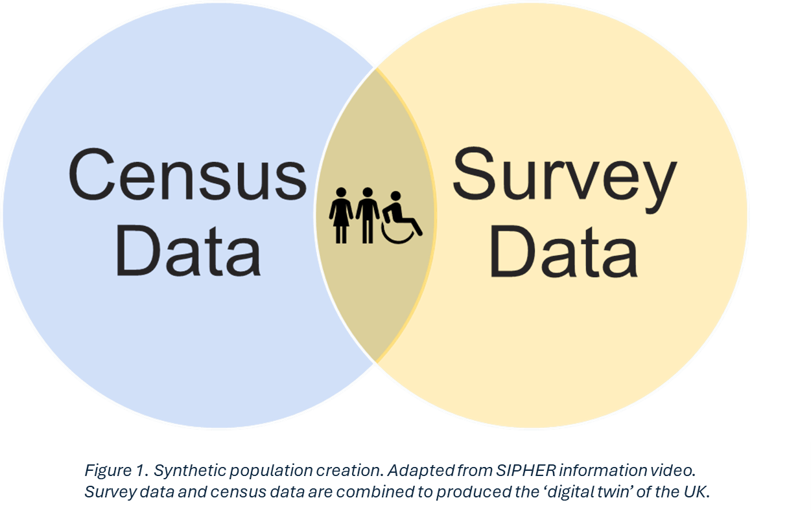
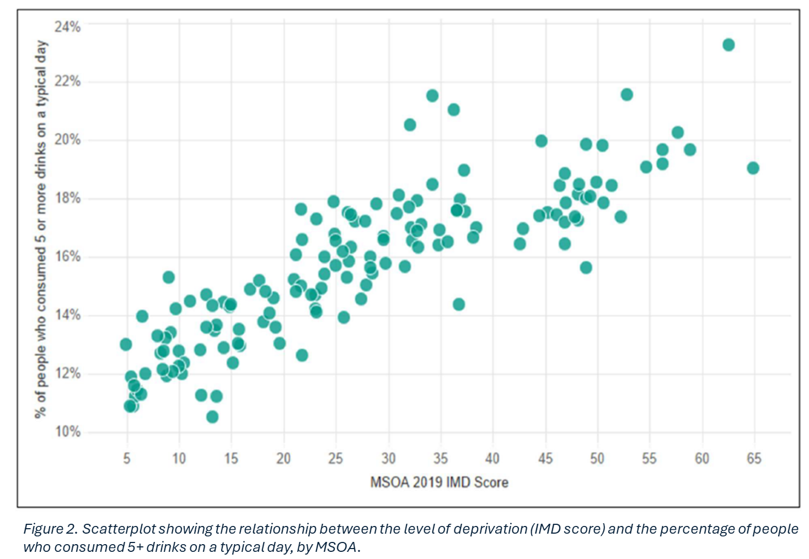
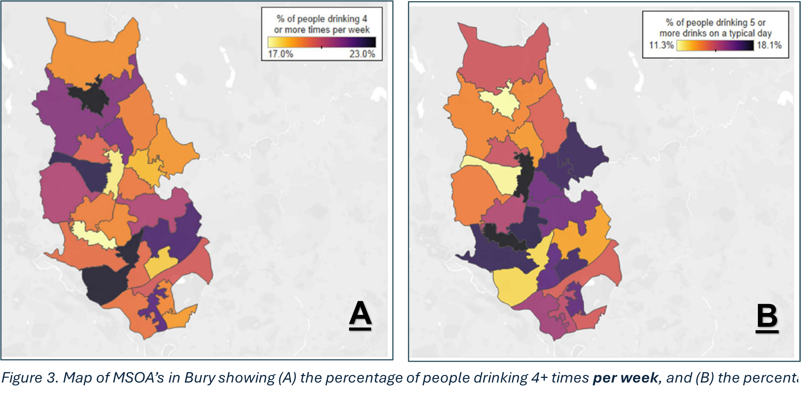
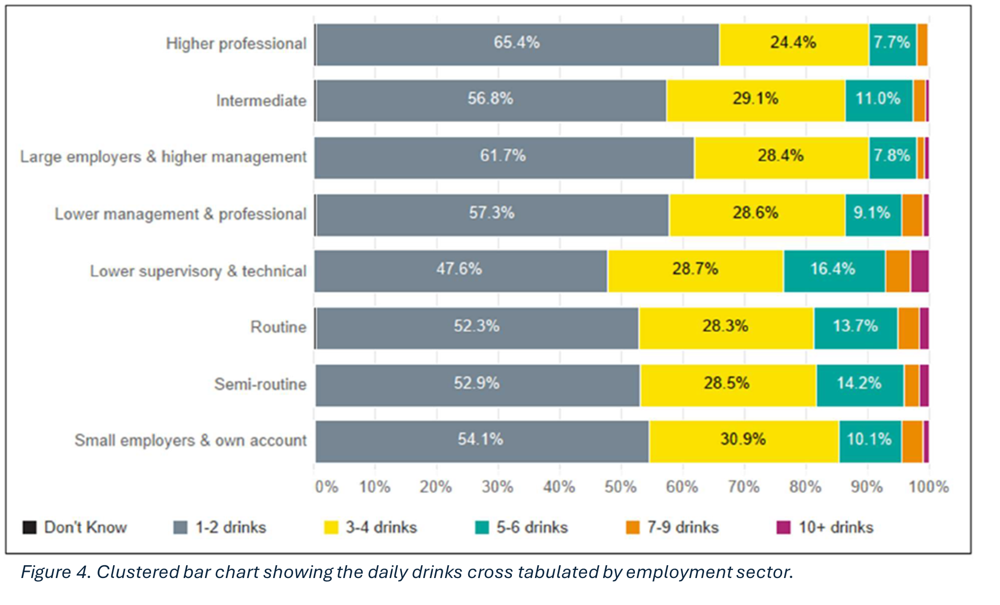

# Synthetic Population User Guide
## Introduction

The United Kingdom (UK) captures information on individuals and households in administrative registers. These registers can be linked and accessed for various purposes such as research, planning of public services, and reporting population statistics. However, these registers tend to be less comprehensive compared to other European countries, particularly Nordic countries (United Nations, 2007). Key factors contributing to these differences include the decentralised nature of UK’s registers, the dominance of a “create-and-destroy” approach for requested data linkages, and the absence of a unified person identification system for cross-register linkages (United Nations, 2007). This limits opportunities for studying interactions among aspects such as health, employment, education, benefit payments, or housing at the individual and household levels in the UK. This in turn creates barriers to testing and modelling different policy scenarios when planning future policy interventions.

Surveys, on the other hand, provide a well-suited and swiftly available alternative to register-based data but typically lack detailed spatial resolution. Area-level linkage involves connecting survey data to specific geographic areas, enabling analysis of regional variations and characteristics. In some instances, area-level linkages of surveys, like Understanding Society (Institute for Social and Economic Research, 2023), can offer finer spatial detail, such as local authority information. However, this often leads to reduced sample sizes for each area, resulting in high uncertainty and wide confidence intervals for local estimates (Höhn et al., 2024). Further disaggregation of survey data to more granular levels, such as Lower layer Super Output Areas (LSOAs), is often impractical due to the sparse numbers of respondents in those smaller areas.

To address these limitations, a ‘digital twin’ of the entire adult (16+) population of England and Wales was developed by SIPHER. Also known as a Synthetic Population, this acts as a mirrored profile of the experiences of this adult population, allowing for the estimation of likely characteristics of 59.5 million adults (16+). This synthetic population was produced through the combination of aggregate level data (Census 2011), with an individual-level longitudinal household survey (Understanding Society) (Figure 1). This creates a model in which the characteristics of the 30,000 survey respondents are repeated throughout England and Wales to generate a representation of the likely characteristics and traits of the whole population. By combining the full geographical coverage of the census with the in-depth data collected in the survey, it allows for the creation of ‘spatially representative individual data’ (Wu et al., 2022). The combination of these data allows the harnessing of the detail-rich data in the survey with the aggregated geographical data across the UK. This provides information about the different characteristics of the population and how these characteristics vary across demographic profiles and geographical locations.

## How will it be useful to me?

The production of a Synthetic Population can also be done on a more local level, using the same sources and techniques. For example, the characteristics of the 30,000 survey respondents can be applied to the 2.8 million adult (16+) population in Greater Manchester, which will act as a representation of the experiences of residents who live there. Conceptually, this is a mirrored image of the population of Greater Manchester and their likely characteristics and traits. The person that originally filled out the survey may reside outside of Greater Manchester but shares characteristics that are representative of someone who does live in a particular region. This approach is valuable at more granular geographical levels, such as Middle layer Super Output Areas (MSOAs), where this level of data does not currently exist.

The Synthetic Population has been utilised across several projects within Greater Manchester so far. One example is its contribution to the evidence base of the [Greater Manchester Independent Prosperity Review (IPR)](https://greatermanchester-ca.gov.uk/media/6715/gmipr-evidence-update-reflections-report-digital-version.pdf); maps produced using the Synthetic Population were used in the Health Inequalities section of the review. A more recent example is its contribution to the ongoing Alcohol Harms for NHS GM (covered here: [Case Study - Greater Manchester]), which is conducted across 5 local authorities (Bolton, Bury, Rochdale, Salford, and Trafford) to investigate those affected by, or at risk of, alcohol-related harm. In this research, the Synthetic Population data was utilised alongside hospital spells data (collected by NHS GM Integrated Care System) and the National Drug Treatment Monitoring System (NDTMS). Beyond Greater Manchester, it has also been utilised in Scotland to observe 10-year projections of the impact of policy changes on mental health within their population.

These projects in Greater Manchester and Scotland are a great example of how this tool can be used for multiple purposes.

## How reliable is this data source?

When considering whether to use the Synthetic Population, it is important to think about the reliability of this synthetic data source and whether it is fit for your purposes. The variables you wish to link from the Synthetic Population will help you in deciding how high your level of confidence should be when looking at the outputs of the data.

As mentioned in a previous section ([Introduction]), survey data was aligned with census data to produce the Synthetic Population dataset. The variables that have been aligned across the [Understanding Society](https://www.understandingsociety.ac.uk/) survey and the Census data can be treated with a high level of confidence, because they draw on survey variables which were used as constraints, or are very strongly associated with these constraints, and will give the most meaningful information ([source](https://greatermanchesterca-my.sharepoint.com/personal/elizabeth_finn_greatermanchester-ca_gov_uk/Documents/SIPHER/syntheticPopulation/technical_user_guideR3_clean.docx)). The 8 constraint variables (and therefor the most reliable variables to investigate) are: age/sex, highest qualification, ethnicity, marital status, economic activity, general health, household tenure, and household type (composition). The 8 variables that are strongly associated with the constraint variables are: occupational group, financial hardship, health indicators and health risk factors, benefit payments, housing quality, neighbourhood safety, and resources available to individuals and households. Applications using survey variables with unknown or unvalidated associations with the constraints, or those reflecting distinct individual experiences (e.g., commuting time), are likely to be less meaningful. External validation of variables prior to usage is recommended.

### External validation

External validation involves comparing the patterns seen in the Synthetic Population with those from a reliable external data source. This helps determine if the Synthetic Population is suitable for a specific context and the related variables.

#### Example: Employment deprivation

To see if the Synthetic Population dataset can accurately reflect employment deprivation as defined by the Scottish Index of Multiple Deprivation (SIMD) 2020, an external validation was conducted. This was chosen because employment deprivation can be clearly measured using the Understanding Society survey.

The SIMD 2020 defines employment deprivation using the following criteria:

-   Working-age individuals receiving Jobseeker’s Allowance.

-   Working-age individuals receiving Incapacity Benefit, Employment and Support Allowance, or Severe Disablement Allowance.

-   Working-age individuals receiving Universal Credit but not employed.

The analysis indicated that the Synthetic Population generally matches well with the SIMD’s measure of employment deprivation, especially in areas with low to medium-high levels of employment deprivation. However, the Synthetic Population might slightly underestimate employment deprivation in areas with very high levels of it.

These differences could be due to the selection effects of who participates in the Understanding Society survey and the different time periods of the data used for comparison. The SIMD 2020 data are based on the 2017 figures from the Department for Work and Pensions (DWP) and involve some statistical modelling, while the survey and constraint data for the Synthetic Population cover various years from 2011 to 2021.

### Internal validation

Internal validation is the processing of checking the accuracy and reliability of the Synthetic Population data by comparing values from the simulated dataset to the original datasets used in the simulation (Wu et al., 2022). This helps ensure that the information is consistent and makes sense internally before using it for analysis. Essentially, this is like double-checking your work to make sure everything lines up correctly.

#### Example: Unique areas

Researchers involved in the creation of the Synthetic Population compared the number of unique areas in the Synthetic Population with the number of unique areas specified in the Census 2011 output area classification. This revealed that 41,726 areas out of 41,729 were matched between the Synthetic Population and the Census 2011, showing only 3 areas that did not match between the simulated data source (Synthetic Population) and the original dataset (Census 2011). The reason behind this discrepancy is that these areas had a population size of zero based on the 2020 population estimates but were non-zero areas in the 2011 Census. The researchers deemed this a small mismatch, so no additional action was taken.

#### Example: Constraint variables

Another step taken by the researchers was to compare the number of created synthetic individuals within each LSOA from the Synthetic Population, with the expected number of individuals who should be living there (based on the Understanding Society dataset). To do this, the expected number of individuals was determined separately for each of the 8 constraint variables and represents the total number of individuals within each LSOA according to the constraint table. Differences in the number of synthetic individuals and the expected number of individuals can occur for two potential reasons:

1.  A misalignment of Understanding Society variables to reflect information captured in the utilised constraint tables.

2.  Poor performance of the spatial microsimulation algorithm when populating areas in the Synthetic Population.

In this case, the Synthetic Population was shown to have an excellent fit across all 8 of the constraint variables, which indicates an excellent alignment of Understanding Society variables with the information provided in the constraint tables, and the well-performing spatial microsimulation algorithm.

### Limitations

Despite the quality control steps taken by the researchers in its creation and validation, the Synthetic Population dataset has certain limitations that users should acknowledge. This section outlines these conceptual limitations for the user. The Synthetic Population does not incorporate individual-level data on actual places of residence, such as those found in special license area-level linages. This means that it does not reflect the true locations of individuals’ residences and should not be considered a substitute for existing data sources like population-based registers. Additionally, the dataset does not capture true household structures. So, while it can be linked with household-level characteristics, it does not reliably nest synthetic individuals with synthetic households.

The Synthetic Population inherits limitations from the Understanding Society survey, such as selection and recall bias. Consequently, it is not suitable for studying outcomes of marginalisation (e.g., illicit drug use, homelessness), routine service use (e.g., hospital treatments, medication use), or outcomes associated with institutionalised populations (e.g., prisons, nursing homes). In theory, all variables included in the Understanding Society survey data files ***“k_indresp”*** and ***“k_hhresp”*** can be linked with the Synthetic Population, allowing for a wide range of questions to be explored. However, not all variables will allow for meaningful application within a synthetic population setting. Below is some general guidance for new users of the Synthetic Population when considering which variables to use in their analysis. Table 1 provides guidance on how much confidence can be given to different variables when looking at the Synthetic Population.

| Confidence Level              | Explanation                                                                                                                            | Examples                                                                                                                                  |
|-------------------------------|----------------------------------------------------------------------------------------------------------------------------------------|-------------------------------------------------------------------------------------------------------------------------------------------|
| Very High                     | Aligned to constraint tables, informing the spatial microsimulation algorithm.                                                         | Age/sex, highest qualification, ethnicity, marital status, economic activity, general health, household tenure, household type.           |
| High, but caution             | Not aligned to constraint tables, but strongly associated with the 8 constraint and/or can be externally validated.                    | Occupational group, financial hardship, health indicators, benefit payments, housing quality, neighbourhood safety, resources available.  |
| Unknown, potentially possible | Not aligned to constraint tables, with unclear association to constraints; careful assessment and/or external validation recommended.  |                                                                                                                                           |
| Unknown, likely problematic   | Not aligned to constraint table, with unclear association to constraints and specific traits making external validation difficult.     | Variables on access to geographical features, specific to recreational activities, daily habits, commuting, time.                         |

 *Table 1. A guide to how much confidence can be given to types of variables within the Synthetic Population, with an explanation of why this is the case for each confidence level.*

From the information provided in Table 1, some general rules can be extracted:

1.  Applications using survey variables aligned with constraints, or strongly associated with them, are generally the most meaningful.

2.  Applications using variables with unknown or unvalidated associations to constraints, or those reflecting distinct individuals' experiences (e.g., commuting time), are less meaningful.

3.  Always perform external validation of variables before use. Examples of external validations are outlined in previous section ([External validation]).

## Case Study - Greater Manchester

The Synthetic Population was used to conduct a project relating to the populations affected by, or at risk of, alcohol-related harm. This research made use of the Synthetic Population in conjunction with hospital spells data (collected by NHS GM Integrated Care System) and the National Drug Treatment Monitoring System (NDTMS) across 5 of the local authorities within Greater Manchester (Bolton, Bury, Rochdale, Salford, and Trafford). The use of the Synthetic Population was crucial in this project, as it allowed each local authority to be looked at individually, rather than having to use high-level district geography which can mask inequalities and different characteristics within each local authority.

The two indicators from Understanding Society used in this study were the frequency of alcohol consumption in the past year and the number of alcoholic drinks consumed on a typical day. As discussed earlier, the reliability and robustness of these indicators vary and must be considered before drawing any conclusions. It is important to note that the two indicators selected have not yet been validated by researchers within SIPHER. However, the researchers involved in this case study believed that these indicators were sufficiently robust. This confidence was based on the low percentage of inapplicable responses (36.1%), leaving 13,727 usable responses, which provided a substantial sample size. The Understanding Society data was combined with census data for GM to create a Synthetic Population for GM, providing data for both indicators for over 390,000 people. This combination enhanced the data’s robustness, allowing for effective modelling of alcohol consumption across the five chosen local authorities.

### Findings

The use of the Synthetic Population in this case study allowed for detailed comparisons both across, as well as within each of the 5 chosen local authorities. It allowed the examination of many different aspects of a topic at a more granular level of detail than has been done previously. For example, a link was found between the level of deprivation in an MSOA, and the percentage of people drinking 5+ drinks on a typical day (Figure 2). Index of Multiple Deprivation (IMD) is used as the measure of deprivation and is a small area measure of relative deprivation across the UK.

As mentioned above, the use of the Synthetic Population also allows for the comparison of MSOA’s within each local authority. Figure 3 illustrates this by showing the percentage of people drinking 4+ times per week (Figure 3A), and the percentage of people drinking 5+ drinks on a typical day (Figure 3B) in Bury. This is a good illustration of the granular level of data that the Synthetic Population can provide, showing how indicators can vary even within local authorities. Taken with the information provided in Figure 2, we can speculate that the areas shown to have higher percentage of people drinking in Figure 3B would also be the areas within Bury that show higher levels of deprivation (IMD score). To further explore this, it would be interesting to produce a map of Bury showing the IMD score by MSOA, to be able to visually compare this to the data shown in Figure 3. The combination of these data sources within the Synthetic Population also allow the investigation other variables’ relationship to the key indicators used in this study. The figure below shows the percentage of daily drinks sorted by employment sector (Figure 4). This shows that those who work in lower supervisory and technical roles are most likely to report drinking 5+ drinks on a typical day (23.7%).

This case study and its findings provide a good example of how the Synthetic Population can be used to study the population of the UK at a smaller-area level. This gives the Synthetic Population the ability to facilitate the investigation of trends and relationships in locations of interest, even at an MSOA level, for both academic and policy-driven purposes. Specifically, this case study provided evidence for a link between alcohol consumption and several other factors, including deprivation of an area, and employment sector. In turn, this can help inform interventions and actions taken by policy makers.

## How can I adapt it for my own use?

### Technical option

You can work through the R code examples contained in this GitHub Repository and edit elements for your purposes. This option gives you more flexibility in what you can investigate and in your choice of visualisations.

1.   **[SynthPop_dataPrep](SynthPop_dataPrep.md)** - Cleans your R workspace, load relevant libraries, and sets key definitions of variables used in later scripts.

2.  **[SynthPop_dataLoad](SynthPop_dataLoad.md)** - This script loads the Synthetic Population and Understanding Society datasets and walks through each stage of merging these datasets together.

### Non-Technical option

For those who don't want to use R code to use the data from the Synthetic Population, there is a Graphical User Interface (GUI) option. You can find this [here](https://sipherdashboard.sphsu.gla.ac.uk/).
